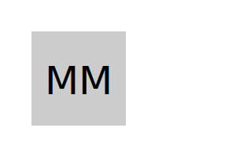

# SVG Logo Maker

Generate simple logos for your projects using this Node.js command-line application. Say goodbye to the need for a graphic designer!



## Table of Contents

- [Description](#description)
- [Features](#features)
- [Requirements](#requirements)
- [Installation](#installation)
- [Usage](#usage)
- [Walkthrough Video](#walkthrough-video)
- [Testing](#testing)
- [Sample Logos](#sample-logos)
- [License](#license)

## Description

As a freelance web developer, you often need simple logos for your projects. This command-line application allows you to create logos in SVG format quickly and easily. You can customize the text, text color, shape, and shape color to fit your project's branding.

## Features

- Input up to three characters for the text.
- Choose the text color using a keyword or hexadecimal value.
- Select from various shapes, including Circle, Triangle, and Square.
- Define the shape's color using a keyword or hexadecimal value.
- Generate an SVG logo that matches your criteria.

## Requirements

- Node.js (13.2.0 or later for ESM support)
- npm (Node Package Manager)

## Installation

1. Clone the repository to your local machine:

   ```bash
   git clone
   https://github.com/MahmoudAhmed0528/SVG-Logo-Maker
   cd svg-logo-maker
   ```

2. Install the project dependencies:
   npm install

## Usage

1. Run the application using the following command:
   node index.js

2. Follow the prompts to customize your logo:
   . Enter up to three characters for the text.
   . Enter the text color (keyword or hexadecimal).
   . Select a shape (Circle, Triangle, or Square).
   . Enter the shape color (keyword or hexadecimal).

3. After completing the prompts, an SVG logo will be generated and saved as logo.svg in the project directory.

4.You can open the generated `logo.svg `file in a web browser to view your logo.

## Walkthrough Video

To see a demonstration of the application's functionality, including how to run it and create a logo, watch the walkthrough video (https://www.youtube.com/watch?v=VU8lJyQX8b4).

## Testing

The application includes unit tests using Jest to verify the correctness of shape rendering. To run the tests, use the following command:
npm test

## Sample Logos

Check out some sample logos created using this application in the examples directory.

## License

This project is licensed under the Mahmoud Ahmed.
